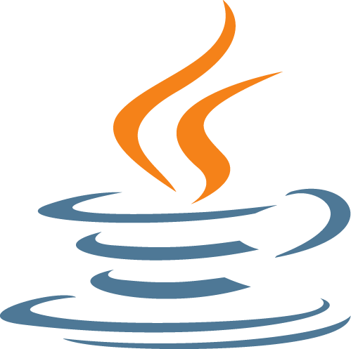
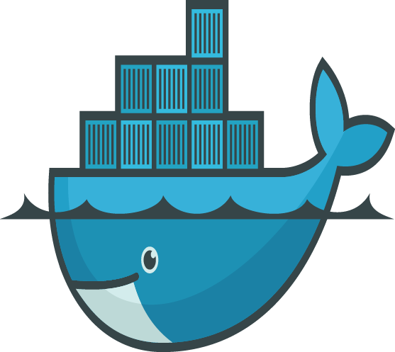

## Language

[row]
[col]

Java

[/col]
[col]

Golang

[/col]
[/row]

## Frameworks

[row]
[col]

Spring Boot

[/col]
[col]

Vert.x

[/col]
[/row]
[row]
[col]

Hibernate

[/col]
[col]

Spring Framework

[/col]
[col]

Struts

[/col]
[/row]

## Database

[row]
[col]

Redis

[/col]
[col]

MS SQL Server

[/col]
[col]

Oracle

[/col]
[/row]

## Tools

[row]
[col]

Maven

[/col]
[col]

Jenkins

[/col]
[col]

Git

[/col]
[col]

Docker

[/col]
[/row]

## IDE

[row]
[col]

IntelliJ IDEA

[/col]
[col]

Eclipse

[/col]
[/row]

## Application/Web Servers

[row]
[col]

Nginx

[/col]
[col]

Apache Tomcat

[/col]
[/row]

## Cloud Platforms

[row]
[col]

Pivotal Cloud Foundry

[/col]
[/row]

## Data Streaming

[row]
[col]

Apache Kafka

[/col]
[/row]